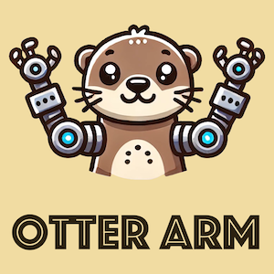

# Otter ARM

## Otter ARMとは？

小型ロボットアームのプロジェクトです。TransfomerベースのAIロボットアーム制御を主軸においたロボットアームです。



## ライセンス

このプロジェクトはMITライセンスの下で公開されています。

### サードパーティライセンス

- `./detr/` ディレクトリには、Apacheライセンス2.0の下で提供されているFacebookの[DETR](https://github.com/facebookresearch/detr)からのコードが含まれています。
- `./act/` ディレクトリには、MITライセンスの下で提供されているTony Z. Zhao氏の[ACT](https://github.com/tonyzhaozh/act)からのコードが含まれています。

詳細は各ディレクトリ内の `LICENSE` ファイルを参照してください。

## 基本構成

Single

- 2カメラ
- Follower ARM x 1
- Leader ARM x 1

Double

- 4カメラ
- Follower ARM x 2
- Leader ARM x 2

## 対応する学習モデル

- ACT(Alohaの学習モデル)

## テレオペ

Single

```
python teleop.py --pair 1
```
Double

```
python teleop.py --pair 2
```

## データセットの作成

Single

```
python record.py --task test1 --pair 1
```
Double

```
python record.py --task test1 --pair 2
```

## データセットの作成(連続)

Single

```
python record.py --task test1 --num 50 --pair 1
```
Double

```
python record.py --task test1 --num 50 --pair 2
```

## 動画作成

直前のタスクの最新のエピソード

```
python movie.py --task test1
```

タスクの名前指定

```
python movie.py --task test1 --name episode_10.hdf5
```

## 学習

収集したデータをnum_epocsで学習

```
python train.py --task test1 --num_epocs 2000
```

|GPU|学習時間目安(2画像)|
|---|---|
|RTX6000 Ada| 3時間 |
