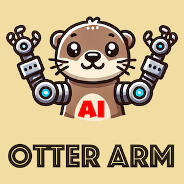

# Otter ARM

## Otter ARMとは？

小型ロボットアームのプロジェクトです。TransfomerベースのAIロボットアーム制御を主軸においたロボットアームです。



## ライセンス

このプロジェクトはMITライセンスの下で公開されています。

### サードパーティライセンス

- `./act/detr/` ディレクトリには、Apacheライセンス2.0の下で提供されているFacebookの[DETR](https://github.com/facebookresearch/detr)からのコードが含まれています。
- `./act/` ディレクトリには、MITライセンスの下で提供されているTony Z. Zhao氏の[ACT](https://github.com/tonyzhaozh/act)からのコードが含まれています。

詳細は各ディレクトリ内の `LICENSE` ファイルを参照してください。

## 基本構成

Single

- 2カメラ
- Follower ARM x 1
- Leader ARM x 1

Double

- 4カメラ
- Follower ARM x 2
- Leader ARM x 2

## 対応する学習モデル

- ACT(Alohaの学習モデル)

## 環境構築

```
git clone https://github.com/FaBoPlatform/OtterARM.git
```

```
cd OtterARM
```

```
conda create -n otter python=3.9
conda activate otter
```

OSX
```
conda install pytorch==2.5.1 torchvision==0.20.1 -c pytorch
```
Windows, Ubuntu
```
conda install pytorch==2.5.1 torchvision==0.20.1 -c pytorch -c nvidia
```


GPUの認識確認

```
python gpu.py
```

```
pip install -r requirements.txt
```

```
cd act/detr && pip install -e . && cd ../..
```

## テレオペ

```
python teleop.py
```

## データセットの作成

```
python record.py --task test1
```


## データセットの作成(連続)

```
python record.py --task test1 --num 50
```

## 動画作成

直前のタスクの最新のエピソード

```
python movie.py --task test1
```

タスクの名前指定

```
python movie.py --task test1 --name episode_10.hdf5
```

## 学習

収集したデータをnum_epocsでepoc数を指定して学習

```
python train.py --task test1 --num_epocs 2000
```

|GPU|学習時間目安(長さ200,1画像)|
|---|---|
|RTX6000 Ada(Ubuntu)| ?分 |
|RTX3090(Ubuntu) | 10分 |
|RTX4060(Ubuntu) | 30分 |
|M3(OSX)| 7時間 |

## 実行

```
python run.py --task test1
```
